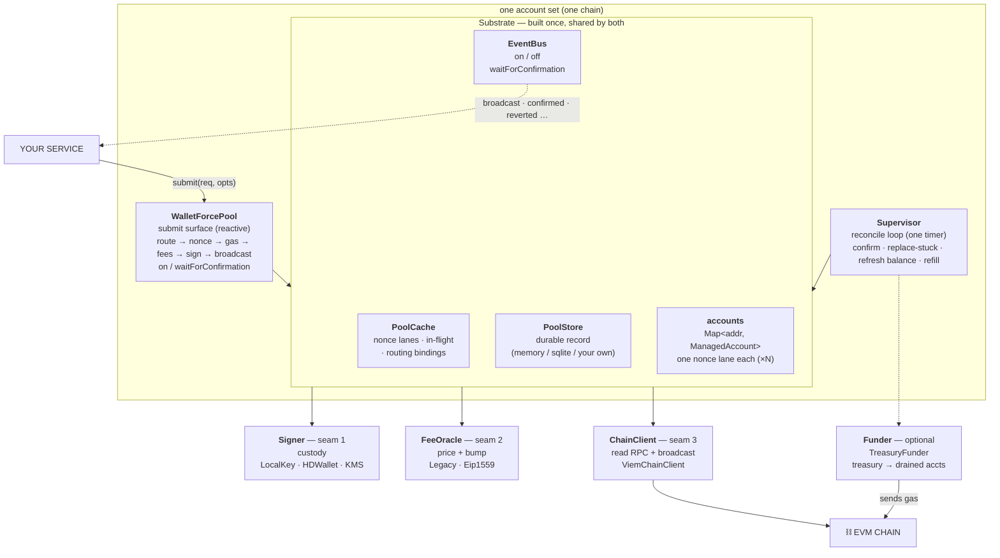
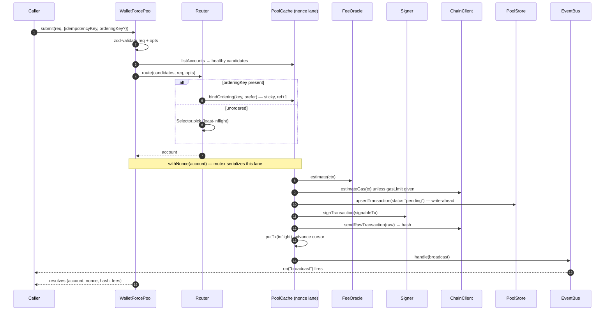
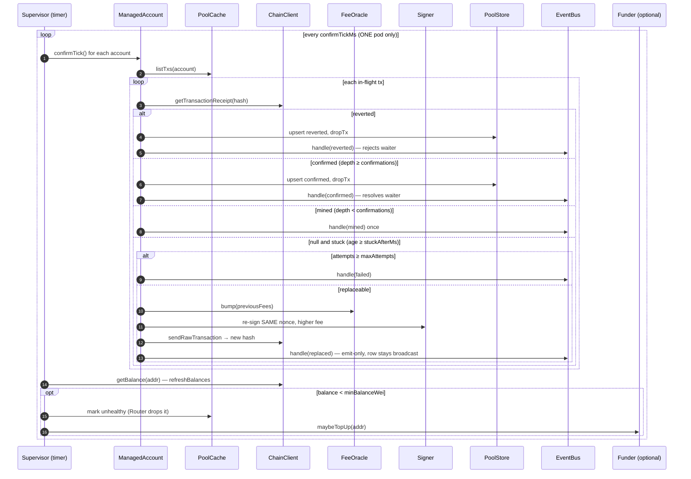
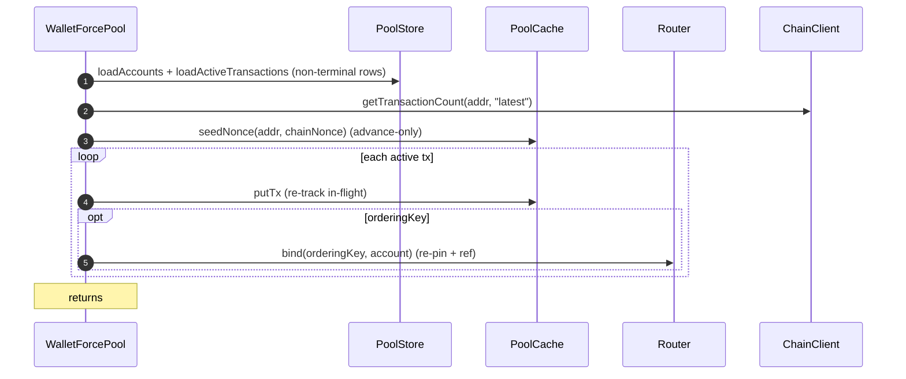

# walletsforce — architecture

A general-purpose **EVM account pool**. You give it signer accounts and a chain;
you call `submit(tx)`. It routes the tx to an account, serializes that account's
nonce lane, signs, broadcasts, confirms, and replaces stuck txs.

> **The core idea:** on an EVM chain each account sends through a strictly
> sequential **nonce** — 1 account = 1 nonce lane = the single-account throughput
> ceiling, and one stuck tx blocks everything behind it (head-of-line blocking).
> **N accounts = N independent lanes**, so you break that ceiling and confine
> head-of-line blocking to one lane.

This document is the map: the landscape, the request/reconcile sequences, every
component and its interface, the data types, and the two deployment shapes.

---

## 1. Landscape

Three things you wire together: a **Pool** (submit surface), a **Supervisor**
(reconcile loop), and the **Substrate** they both run over. Build the substrate
**once** and inject it into both, so a submit and its confirmation meet over one
working set.



**Two deployment shapes** fall out of the Pool/Supervisor/Substrate split:

| Mode | Cache / Store / Bus | Topology |
|---|---|---|
| **individual** (default) | in-memory | one process runs Pool **and** Supervisor |
| **group** | shared (Redis cache / bus, SQL store) | many submit pods run Pools; **one** pod runs the Supervisor |

> Run the Supervisor in exactly **one** place per account set — the reconcile tick
> must never run concurrently across pods.

---

## 2. Components & responsibilities

| Component | Responsibility |
|---|---|
| **`WalletForcePool`** | The submit surface: validate → route → nonce → gas → fees → sign → broadcast. **Reactive** — no background loop. Exposes the event API (`on`/`waitForConfirmation`). |
| **`Supervisor`** | The reconcile loop: on a timer, confirm/replace stuck txs, refresh balances, and (if given a `Funder`) refill drained accounts. You `start()` it, in exactly one place. |
| **`Substrate`** | The shared runtime injected into both: `{ cache, store, bus, accounts }`. Built once by `createSubstrate(config, opts?)`. |
| **`ManagedAccount`** | One per address — the unit of parallelism. Owns its send pipeline, its confirm/replace step, and its in-flight cap. Built once and shared (not duplicated per object). |
| **NonceLane** *(in `PoolCache.withNonce`)* | Async mutex + nonce allocator for one account. Serializes allocation+broadcast; advances the cursor **only on success** (no gaps). In-memory = in-process mutex; Redis = per-account lock (serializes across pods). |
| **`Router` / `WalletSelector`** | Picks the account per request. Sticky (ref-counted) for an `orderingKey`; least-in-flight otherwise. |
| **`Signer`** *(seam 1)* | Custody. Signs a fully-specified tx; returns raw bytes. |
| **`FeeOracle`** *(seam 2)* | Gas pricing + replacement-bump policy. |
| **`ChainClient`** *(seam 3)* | The single chokepoint for node I/O (reads + broadcast + error classification). |
| **`PoolCache`** | Fast working set: nonce lanes, in-flight txs, per-account gauge, sticky bindings. Coordination point in group mode. Not the source of truth. |
| **`PoolStore`** | Durable record (source of truth). `pool.start()` rebuilds the cache from it. `InMemoryStore` (default) or `SqliteStore` (WAL, crash recovery), or bring your own. |
| **`EventBus`** | Lifecycle event port shared by both, so a waiter on the submit side resolves when the Supervisor confirms. |
| **`Funder`** *(optional)* | Auto-refills drained accounts from a treasury account. Bundled: `TreasuryFunder`. |
| **`PoolRegistry`** | Thin multi-chain wrapper: one `WalletForcePool` per chain id. |

---

## 3. Sequences

### 3.1 Submit — resolves on **broadcast** (mempool), not on confirmation



> `pending` is an internal write-ahead status — persisted before broadcast so a
> crash mid-send is recoverable — and is **never emitted**. If the lane's `fn`
> throws (cap hit, broadcast error), the cursor does **not** advance and the sticky
> ref is released, so no nonce gap and no leaked binding.

### 3.2 Reconcile tick — the Supervisor, every `confirmTickMs`



> **Don't wait on `hash`.** A stuck tx is replaced by re-signing the *same nonce*
> with bumped fees, so its hash changes. The stable identifier is the
> **`idempotencyKey`** — `waitForConfirmation(key)` correlates on that, resolving on
> `confirmed` and rejecting on `reverted`/`failed`.

### 3.3 Boot — `pool.start()` = `restore()`



---

## 4. Interfaces

### 4.1 Build the shared runtime — `createSubstrate`

```ts
function createSubstrate(config: WalletConfig, opts?: SubstrateOptions): Substrate;
function createStore(cfg: StoreConfig): PoolStore;

interface Substrate {
  cache: PoolCache;
  store: PoolStore;
  bus: EventBus;
  /** The owned account set — built ONCE and shared by pool + supervisor. */
  accounts: Map<string, ManagedAccount>;
}

interface SubstrateOptions {
  store?: StoreConfig | PoolStore;   // default { kind: "memory" }
  cache?: PoolCache;                 // default in-memory
  bus?: EventBus;                    // default in-memory over the cache
}

type StoreConfig = { kind: "memory" } | { kind: "sqlite"; path: string };
```

### 4.2 Submit surface — `WalletForcePool`

```ts
class WalletForcePool {
  constructor(config: WalletPoolConfig, substrate: Substrate);

  start(): Promise<number>;   // = restore(): rebuild from store; returns # re-tracked
  stop(): Promise<void>;      // graceful (reactive pool; nothing to flush)
  restore(): Promise<number>;

  submit(req: TxRequest, opts: SubmitOptions): Promise<SubmitResult>; // resolves on BROADCAST

  /** Resolves on `confirmed`; rejects on `reverted`/`failed`/timeout. Correlates by
   *  idempotencyKey (NOT hash). Register right after submit: observes FUTURE events. */
  waitForConfirmation(idempotencyKey: string, opts?: { timeoutMs?: number }): Promise<TxEventRecord>;

  reattach(tx: ReattachInput): Promise<void>;         // resume tracking a tx signed elsewhere
  on(event: TxEvent, cb: (rec: TxEventRecord) => void): void;
  off(event: TxEvent, cb: (rec: TxEventRecord) => void): void;

  wallets(): Promise<WalletState[]>;
  stats(): Promise<{ wallets: WalletState[]; stickyKeys: number }>; // stickyKeys → leak gauge
}
```

### 4.3 Reconcile loop — `Supervisor`

```ts
class Supervisor {
  constructor(config: SupervisorConfig, substrate: Substrate, funder?: Funder);
  start(): void;          // start the confirm / replace / refresh (/ refill) loop
  stop(): Promise<void>;  // stop scheduling; lets the in-flight tick finish
}
```

### 4.4 Config split — policy only (runtime lives in the Substrate)

```ts
// Shared identity + account inputs. Both Pool and Supervisor build accounts from this.
interface WalletConfig {
  ownerId: string;                 // static-partition owner (this instance owns exactly `signers`)
  chainId: number;
  signers: Signer[];               // the owned account set — one nonce lane each
  chainClient: ChainClient;
  feeOracle: FeeOracle;
  confirmations?: number;          // depth before "confirmed". default 1
  stuckAfterMs?: number;           // unmined this long → bump + replace. default 30000
  maxAttempts?: number;            // replacement attempts before "failed". default 5
  maxInflightPerAccount?: number;  // queued+unconfirmed cap; submit() throws above it. default 512
  logger?: Logger;
}

interface WalletPoolConfig extends WalletConfig {
  selector?: WalletSelector;       // default: LeastInflightSelector
}

interface SupervisorConfig extends WalletConfig {
  confirmTickMs?: number;          // receipt poll cadence. default 4000
  minBalanceWei?: bigint;          // below this → account unhealthy, dropped from rotation
  onLowBalance?: (w: { address: Address; balanceWei: bigint }) => void;
}
```

### 4.5 Seam 1 — `Signer` (custody)

```ts
interface Signer {
  readonly address: Address;
  /** Sign EXACTLY the given tx. Deterministic, no hidden state. Returns raw bytes. */
  signTransaction(tx: SignableTx): Promise<Hex>;
}
// Bundled: LocalKeySigner (in-process key; dev / low-value),
//          HDWalletSigner via deriveHDSigners(mnemonic, n) (N lanes from one seed, BIP-44).
// Production: implement over a KMS/HSM/remote signing service.
```

### 4.6 Seam 2 — `FeeOracle` (price + bump)

```ts
interface FeeContext { chainId: number; attempt: number; client: ChainClient } // attempt: 0 first send

interface FeeOracle {
  estimate(ctx: FeeContext): Promise<FeeFields>;
  /** Replacement fees. MUST beat the node's rule (>= ~12.5% over `previous`). */
  bump(previous: FeeFields, ctx: FeeContext): Promise<FeeFields>;
}
// Bundled: LegacyFeeOracle, Eip1559FeeOracle. Default bump: +12.5% (DEFAULT_BUMP_NUM/DEN).
```

### 4.7 Seam 3 — `ChainClient` (read RPC + broadcast)

```ts
interface ChainClient {
  getTransactionCount(addr: Address, tag: "pending" | "latest"): Promise<number>;
  estimateGas(tx: SignableTx): Promise<bigint>;
  getBalance(addr: Address): Promise<bigint>;
  getBaseFeePerGas(): Promise<bigint | null>;                 // null on legacy chains
  sendRawTransaction(raw: Hex): Promise<Hash>;                // idempotent: re-send is safe
  getTransactionReceipt(hash: Hash): Promise<Receipt | null>; // null = not yet mined
  getBlockNumber(): Promise<bigint>;
  classifyError(err: unknown): RpcErrorClass;
}
// Bundled: ViemChainClient (over viem/actions). `classifyRpcError` helper exported.
```

### 4.8 Routing — `Router` / `WalletSelector`

```ts
interface WalletSelector {
  pick(candidates: WalletState[], req: TxRequest): Address;   // among healthy candidates
}

interface Router {
  route(candidates: WalletState[], req: TxRequest, opts: SubmitOptions): Promise<Address>;
  bind(orderingKey: string, account: Address): Promise<void>; // re-pin + acquire a ref (reattach/restore)
  release(orderingKey: string): Promise<void>;                // release one ref; evict at zero
  size(): Promise<number>;                                    // sticky bindings (leak observability)
}
// Bundled: DefaultRouter (sticky-by-orderingKey, ref-counted) + LeastInflightSelector.
```

### 4.9 Substrate ports — `PoolCache` / `PoolStore` / `EventBus`

```ts
interface PoolCache {
  // nonce lane (cross-pod coordination primitive)
  withNonce<T>(account: Address, fn: (nonce: number) => Promise<T>): Promise<T>; // cursor advances only if fn resolves
  seedNonce(account: Address, atLeast: number): Promise<void>;   // advance-only (boot / nonce-drift)
  peekNonce(account: Address): Promise<number | undefined>;
  // in-flight working set (confirm / replace / backpressure)
  putTx(rec: TransactionRecord): Promise<void>;
  dropTx(account: Address, nonce: number): Promise<void>;
  listTxs(account: Address): Promise<TransactionRecord[]>;
  countTxs(account: Address): Promise<number>;                   // enforces the in-flight cap
  // per-account gauge (routing / health)
  putAccount(rec: AccountRecord): Promise<void>;
  listAccounts(ownerId: string, chainId: number): Promise<AccountRecord[]>;
  // sticky routing bindings (shared so all pods agree per orderingKey)
  bindOrdering(ownerId: string, orderingKey: string, prefer: Address): Promise<Address>;
  releaseOrdering(ownerId: string, orderingKey: string): Promise<void>;
  orderingCount(ownerId: string): Promise<number>;
}

interface PoolStore {
  upsertAccount(rec: AccountRecord): Promise<void>;
  loadAccounts(ownerId: string, chainId: number): Promise<AccountRecord[]>;
  upsertTransaction(rec: TransactionRecord): Promise<void>;      // write-ahead + every status change
  loadActiveTransactions(ownerId: string, chainId: number): Promise<TransactionRecord[]>; // recovery set
}
// Bundled: InMemoryStore (drops terminal rows to stay bounded) + SqliteStore (WAL, history retained).

interface EventBus {
  on(event: TxEvent, cb: (rec: TxEventRecord) => void): void;
  off(event: TxEvent, cb: (rec: TxEventRecord) => void): void;
  waitForConfirmation(idempotencyKey: string, opts?: { timeoutMs?: number }): Promise<TxEventRecord>;
  handle(rec: TxEventRecord): void;                              // lifecycle sink for ManagedAccounts
}
// Bundled: InMemoryEventBus (single process). A Redis-backed impl fans events across pods (group mode).
```

### 4.10 Optional — `Funder` (auto-refill)

```ts
interface Funder { maybeTopUp(addr: Address): Promise<void> }

interface TreasuryFunderOptions {
  signer: Signer;            // the treasury account — keep SEPARATE from the pool signers
  chainClient: ChainClient;
  feeOracle: FeeOracle;      // reuse the pool's oracle
  chainId: number;
  targetBalanceWei: bigint;  // top drained accounts up to (at least) this — set above minBalanceWei
  minTreasuryWei?: bigint;   // never spend the treasury below this. default 0n
  logger?: Logger;
}
// TreasuryFunder: own nonce lane, at most one top-up per recipient in flight, treasury floor.
```

---

## 5. Data types

```ts
type Address = `0x${string}`; // 20-byte      type Hex = `0x${string}`; // arbitrary bytes
type Hash    = `0x${string}`; // 32-byte

type FeeFields =
  | { type: "legacy";  gasPrice: bigint }
  | { type: "eip1559"; maxFeePerGas: bigint; maxPriorityFeePerGas: bigint };

// What you submit. `data` = calldata → a contract call; omit it for a plain transfer.
interface TxRequest     { to: Address; data?: Hex; value?: bigint; gasLimit?: bigint }
interface SubmitOptions { idempotencyKey: string; orderingKey?: string; metadata?: Record<string, unknown> }
interface SubmitResult  { account: Address; nonce: number; hash: Hash; fees: FeeFields }

// A fully-specified tx handed to a Signer.
interface SignableTx { chainId: number; nonce: number; to: Address; data?: Hex; value?: bigint; gas: bigint; fees: FeeFields }

// Replayed on boot to resume tracking an in-flight tx.
interface ReattachInput { idempotencyKey: string; account: Address; nonce: number; hash: Hash; fees: FeeFields; orderingKey?: string; metadata?: Record<string, unknown> }

// Emitted on every lifecycle transition; the caller persists these.
interface TxEventRecord { idempotencyKey: string; orderingKey?: string; account: Address; nonce: number; hash: Hash; status: TxStatus; fees: FeeFields; attempts: number; metadata?: Record<string, unknown>; error?: string; at: number }

interface WalletState { address: Address; inflightCount: number; nonceCursor: number; balanceWei: bigint; healthy: boolean }
interface Receipt     { status: "success" | "reverted"; blockNumber: bigint; transactionHash: Hash }

type RpcErrorClass = "nonce-drift" | "transient" | "revert" | "fatal";
interface Logger { debug(m: string, x?: unknown): void; info(m: string, x?: unknown): void; warn(m: string, x?: unknown): void; error(m: string, x?: unknown): void }
```

> **Status vs event.** `TxStatus` is what a row is *persisted* as
> (`pending | broadcast | mined | confirmed | reverted | failed`). `TxEvent` is
> what you *observe* (`broadcast | mined | confirmed | replaced | reverted |
> failed`) — no `pending` (internal write-ahead), and `replaced` is emit-only
> (a fee-bump notification, never a stored row status).
>
> Data types are defined as **zod schemas** (exported alongside the inferred types,
> e.g. `txRequestSchema`) so the engine validates at its boundaries. Behavioral
> interfaces (`Signer`, `ChainClient`, …) are plain TS — zod validates data, not behavior.

The persistence model is two tables (see `store/models.ts`):
- **`accounts`** — one row per owned account (`AccountRecord`): cursor, balance, health, BIP-44 index.
- **`transactions`** — one row per tx across its whole lifecycle (`TransactionRecord`), keyed by
  `idempotencyKey`. Keeps the full signable so a stuck tx can be re-signed after a crash. Recovery
  set on boot = rows where `status NOT IN (confirmed, reverted, failed)`.

---

## 6. Ownership contract

| walletsforce **guarantees** | **you** own |
|---|---|
| correct, gap-free nonce per account | idempotency / dedupe on your business unit |
| single-writer per account (static partition) | exactly-once *effect* across a crash |
| no in-process duplicate sends | choosing durability: in-memory (default) or a durable `PoolStore` |
| receipt tracking + stuck-tx replacement | running the Supervisor in exactly one place (group mode) |

Durability is a **choice**: the default in-memory store survives nothing; inject the
SQLite store (or your own `PoolStore`) and the pool write-aheads before broadcast and
rebuilds via `restore()` on boot. Dedupe (exactly-once *effect*) is always yours —
check for the `idempotencyKey` before calling `submit`.

---

## 7. Packaging notes

- **ESM-only** (`"type": "module"`). Node **≥ 18** for the in-memory path; the SQLite
  store needs Node **≥ 22.5** (built-in `node:sqlite`).
- **`viem` is a `peerDependency`** — the consumer owns a single viem copy (shared types
  and runtime). `zod` is an internal `dependency` (the public API uses plain objects).
- Built with `tsup` → `dist/index.js` + `dist/index.d.ts`; `viem`/`zod` are external.
- **Status:** individual + group-*ready* (the substrate split is done and interfaces are
  defined); the Redis cache / Redis bus / SQL store impls and the Supervisor leader-lease
  are the remaining group-mode work.
```
